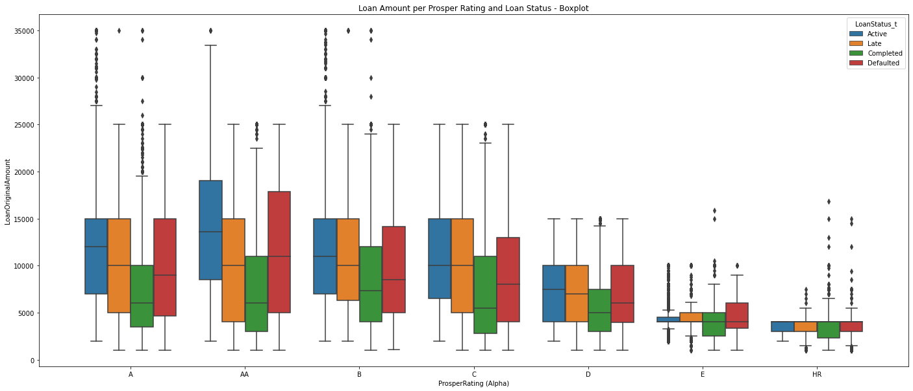

# (Loan Dataset - Communicating Data Findings)
## by (Felipe Silverio)

## Dataset

> This dataset contains data related to loans offered by the credit comapny Prosper. There are over 110 thousand loans with 81 variables. This study will investigate the following variables: Term, LoanStatus, ProsperRating, BorrowerRate, EmploymentStatus, ListingCategory, StatedMonthlyIncome, TotalProsperLoans, LoanOriginalAmount, LoanOriginalDate, Recommendations and Investors. 

## Summary of Findings

It seems that most of the loans in this dataset is either Current, Completed or Chargeoff. Past due loans are split throughout several groups being over 120 days the category with less share, and the risk of a loan is it's default. It seems that the loan dynamic is healthy due to the share of completed loans.

Taking a look at our new graph, the histogram, it's possible to have a better view of our data distribution. It seems that most data points falls between 2000 and 6000 Stated Monthly Income.

The biggest group is Employed followed by full-time, self-employed and Other. It seems that this column might be wrongly named. A very small part is considered Retired or not employed, and the rest of the categories are actually types of employments. Therefore despite for retired and not employed, all the others are Employed but with different kinds of employment.

Lower your rating, bigger the amount of individuals with employment status Not Employed, Self-employed, Retired and Part-Time.

I can't determine a conclusion when it comes to credit health, but we may see that Defaulted category is the one with smaller amount of credit, although Completed debts are the second lowest category. 

Most prevalent Listing category is Debt - which can be used for multiple purposes, followed by Others which can be a series of other minor kinds of debts categories

Prosper Rating D is the most frequent group among Loan Status despite for Active. A and AA being the best rating categories, seems to have the second lowest share in both Default and Late. It doesnt look like there's an exact correlation between prosper rating and loan status, since the lower rating categories has a good representation in Completed and Active.

Credits tends to be lower in Completed status along all prosper ratings, and despite for A and AA ratings, the amount of credits for Active and Late tends to be similar

Credits of Active loan status seems to be the biggest along all listing categories.Except for Active, all other loan status median seems to be similar throughout the listing categories

Looking for this correlation table, there is not variable match where we have at least a slightly strong correlation (>50 or <-50). After transforming our categories to numerical equivalents to use the correlation function, we still can't find a strong correlation among them.

## Key Insights for Presentation

> 